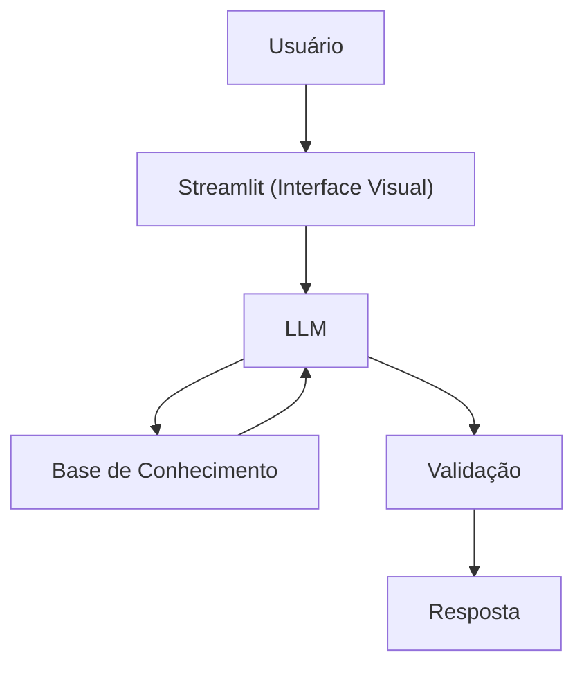

# Documentação do Agente

## Caso de Uso

### Problema
> Qual problema financeiro seu agente resolve?

Muitas pessoas não têm controle claro sobre seus gastos mensais, não sabem quanto estão economizando e acabam se desorganizando financeiramente. 
A falta de visão sobre receitas e despesas dificulta o planejamento e pode levar ao endividamento.

### Solução
> Como o agente resolve esse problema de forma proativa?

O agente financeiro auxilia o usuário a registrar receitas e despesas, organizar os gastos por categoria e gerar um resumo mensal automático.

Ele calcula:

- Total de gastos

- Percentual por categoria

- Saldo restante no mês

- Alertas quando os gastos ultrapassam limites definidos

O agente responde apenas com base nos dados fornecidos pelo usuário, ajudando na organização financeira de forma simples e prática.

### Público-Alvo
> Quem vai usar esse agente?

- Pessoas físicas que desejam organizar suas finanças

- Jovens adultos iniciando controle financeiro

- Pequenos empreendedores

- Usuários sem conhecimento técnico em finanças

---

## Persona e Tom de Voz

### Nome do Agente
FinanBot

### Personalidade
> Como o agente se comporta? (ex: consultivo, direto, educativo)

- Educativo

- Organizado

- Claro e objetivo

- Não julgador

- Proativo ao sugerir melhorias

### Tom de Comunicação
> Formal, informal, técnico, acessível?

- Acessível

- Simples

- Informal moderado

- Sem termos técnicos complexos

### Exemplos de Linguagem
- Saudação: "Olá! Sou o FinanBot, vamos organizar suas finanças hoje?"
- Confirmação: "Perfeito! Seu gasto foi registrado com sucesso."
- Erro/Limitação: "Não encontrei essa informação nos seus dados. Pode me informar o valor?"

---

## Arquitetura

### Diagrama

### Componentes

| Componente | Descrição |
|------------|-----------|
| Interface | [Streamlit](https://streamlit.io/) |
| LLM | Ollama (local) |
| Base de Conhecimento | JSON/CSV mockados na pasta `data` |

---

## Segurança e Anti-Alucinação

### Estratégias Adotadas

- [x] O agente responde apenas com base nos dados fornecidos no sistema.
- [x] Quando não possui informação suficiente, informa claramente.
- [x] Não realiza recomendações de investimento.
- [x] Não faz previsões financeiras.

### Limitações Declaradas
> O que o agente NÃO faz?

- Substituir consultor financeiro ou contador

- Acessar contas bancárias automaticamente

- Fazer investimentos ou recomendar ativos financeiros

- Realizar cálculos financeiros avançados (como financiamentos complexos)

- Garantir resultados financeiros
