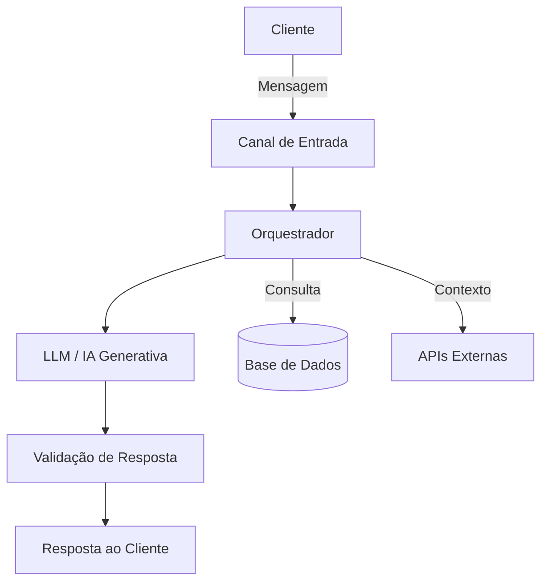

# Arquitetura da Solução

## Visão Geral

> Descreva brevemente como sua solução funciona de ponta a ponta.

[Sua descrição aqui]

## Diagrama da Arquitetura

> Use Mermaid para criar seu diagrama (renderiza direto no GitHub). Abaixo um exemplo que você pode adaptar:

## Componentes

### 1. Canal de Entrada
> Como o cliente interage com a BIA? (app, WhatsApp, voz, etc.)

[Sua descrição aqui]

### 2. Orquestrador
> Qual componente gerencia o fluxo da conversa?

[Sua descrição aqui]

### 3. IA Generativa
> Qual o papel da LLM na sua solução? Quando ela é acionada?

[Sua descrição aqui]

### 4. Camada de Segurança
> Como você evita alucinações e garante respostas confiáveis?

[Sua descrição aqui]

## Fluxo de Dados

> Descreva o caminho que a informação percorre desde a pergunta até a resposta.

1. [Passo 1]
2. [Passo 2]
3. [Passo 3]

## Estratégia Omnichannel

> Como a solução se adapta aos diferentes canais mantendo a experiência consistente?

[Sua descrição aqui]
